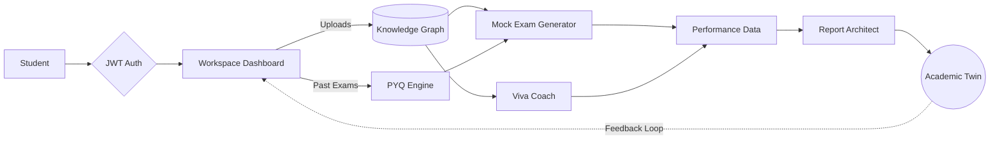
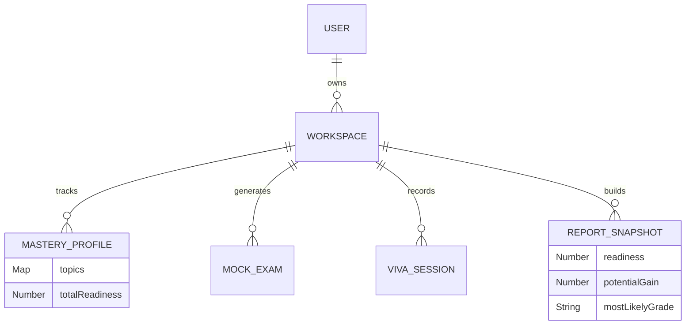

# 🎓 Academic Agent
**The AI-Powered Intelligence Platform for Personalized Education**

[](https://opensource.org/licenses/MIT)
[](https://nodejs.org)
[](https://reactjs.org)
[](https://mongodb.com)
[](https://deepmind.google/technologies/gemini/)

_Academic Agent transforms university syllabi and past exams into an interactive, predictive, and hyper-personalized **Academic Twin**—helping students master their subjects through AI-driven Mock Exams and real-time Viva Coaching._

<br/>


</div>

---

## 🚨 The Problem

University students face massive amounts of unstructured study material, outdated evaluation methods, and high exam anxiety. They struggle to identify exactly what to study and constantly ask: *"Am I ready for the exam?"* Traditional studying lacks **predictive insights**, **real-time feedback**, and **personalized gap analysis**.

## 💡 The Solution

**Academic Agent** eliminates exam anxiety by converting static syllabi into a living, breathing **Academic Twin**. Our AI digests historical exam data (PYQs) to predict what matters most, continuously evaluates the student through dynamic Mock Exams and Voice-to-Text Viva sessions, and synthesizes performance data into actionable Intelligence Reports.

---

## ✨ Key Features

| Feature | Description |
| :--- | :--- |
| 🧠 **Academic Twin** | A unified Knowledge Graph tracking mastery across hundreds of syllabus concepts. |
| 📈 **PYQ Engine** | Analyzes Previous Year Questions to predict high-probability exam topics. |
| 📝 **Mock Exam Generator** | Auto-generates targeted exams focusing heavily on the student's known weak areas. |
| 🎙️ **Viva Coach** | Interactive vocal practice using Speech-to-Text and AI concept evaluation. |
| 📊 **Report Architect** | Generates executive-level intelligence reports to pinpoint readiness scores. |
| 🔐 **Multi-User Auth** | JWT-secured, multi-tenant architecture allowing students to have isolated workspaces. |

---

## 🏗️ Architecture

### High-Level Workflow



### The "Academic Twin" Concept

Rather than just displaying test scores, the backend builds a multi-dimensional array mapping the student's mastery across all extracted concepts. When the student takes a **Mock Exam** or completes a **Viva Session**, the twin's `readiness` score dynamically adjusts based on strict weighted algorithms.

---

## 📸 UI / UX Showcase

<div align="center">
  <!-- Replace src with your Dashboard screenshot URL -->
  


<div align="center">
  <br/>
  <em>Next-Gen Academic Analytics Dashboard</em>
</div>

<br/>

### Core Modules

| Authentication & Setup | Subject Configuration |
| :---: | :---: |
|  |  |
| <i>Minimalist, secure JWT Authentication</i> | <i>Workspace generation & theme selection</i> |

| Knowledge Graph & Predictions | Analytics Health |
| :---: | :---: |
|  |  |
| <i>PYQ Engine identifying Emerging Trends</i> | <i>Graph Confidence & Extraction Metrics</i> |

---

## 🚀 Installation Guide

### Prerequisites
- Node.js (v18+)
- MongoDB Atlas URI
- Google Gemini API Key

### 1. Clone the repository
```bash
git clone https://github.com/yourusername/academic-agent.git
cd academic-agent
```

### 2. Backend Setup
```bash
cd backend
npm install
# Create your .env file
cp .env.example .env
npm run dev
```

### 3. Frontend Setup
```bash
cd ../frontend
npm install
npm run dev
```

The app will be running at `http://localhost:5173`.

---

## 🔑 Environment Variables

Create a `.env` file in the `backend` directory:

```env
PORT=5000
MONGODB_URI=mongodb+srv://<user>:<password>@cluster.mongodb.net/academic_agent
JWT_SECRET=your_super_secret_jwt_key
GEMINI_API_KEY=your_google_gemini_key
DEMO_MODE=true # Set to true to bypass AI rate limits during Hackathon demos
```

---

## 🌐 API Architecture

Our RESTful API uses Express routers isolated by entities.

| Route | Method | Description |
| :--- | :--- | :--- |
| `/api/auth/register` | `POST` | Issues JWT for new students |
| `/api/workspaces` | `POST` | Creates a new isolated subject workspace |
| `/api/workspaces/:id/viva/evaluate` | `POST` | Evaluates student speech against expected concepts |
| `/api/workspaces/:id/report` | `GET` | Triggers the Report Architect algorithm |

---

## 🗄️ Database Schema Overview



---

## 📁 Folder Structure

```text
academic-agent/
├── backend/
│   ├── config/          # Database & Env configurations
│   ├── middleware/      # JWT & Error handlers
│   ├── models/          # Mongoose Schemas (Workspace, ReportSnapshot)
│   ├── routes/          # Express Routers (auth, workspace, viva)
│   ├── services/        # AI integrations (ModelRouter)
│   └── server.js        # App entry point
└── frontend/
    ├── public/          # Favicon & Static assets
    ├── src/
    │   ├── components/  # Reusable UI (Cards, Badges)
    │   ├── context/     # React Context (Auth, Workspace)
    │   ├── views/       # Main Pages (Dashboard, ReportArchitect, VivaChat)
    │   ├── index.css    # Tailwind & Theme configuration
    │   └── main.jsx     # Vite entry point
```

---

## 🏆 Hackathon Highlights

Academic Agent was built with extreme resilience in mind:
- **Fallback Circuit Breakers**: If the LLM quota is exhausted, the `ModelRouter` instantly fails over to a mock deterministic fallback to keep the demo running seamlessly.
- **Defensive Data Parsing**: Mathematical safeguards prevent empty datasets from corrupting MongoDB with `NaN` states.
- **Glassmorphic UI**: High-end, brutalist typography blended with modern dashboard aesthetics.

---

## 🔮 Future Roadmap

- [ ] **Canvas/Blackboard Integration**: Direct ingestion of university assignments.
- [ ] **Voice Synthesis**: Give the Viva Coach a synthesized, realistic voice to speak back to the student.
- [ ] **Peer-to-Peer Matchmaking**: Connect students with inverted Academic Twins (where one is strong, the other is weak) for mutual study sessions.

---

## 🤝 Contributors

- **Your Name** - Lead Developer & Architect
- *Add team members here*

## 📜 License

This project is licensed under the MIT License - see the [LICENSE.md](LICENSE.md) file for details.

---

<div align="center">
  <p><i>"The future of education is not mass instruction, but precise personalization."</i></p>
</div>
